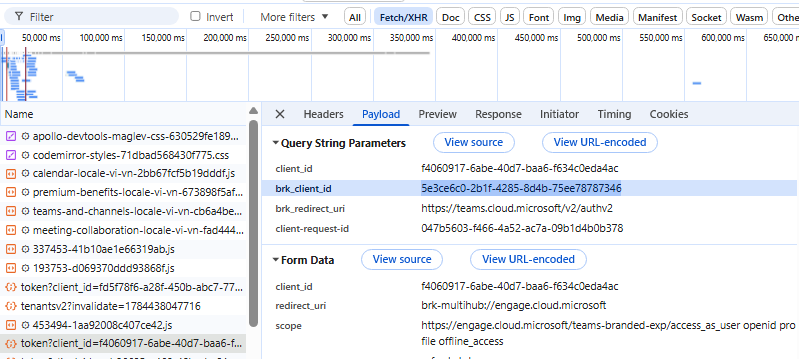
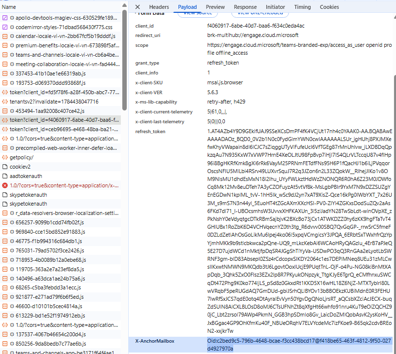
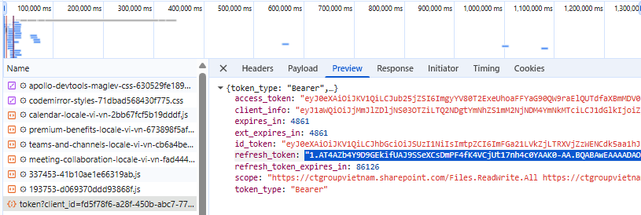

# Teams Daily Report Bot

Bot tự động tạo hoặc tìm post cha trong Microsoft Teams channel, sau đó reply báo cáo ngày của từng member vào đúng thread. Tool được thiết kế để chạy liên tục bằng `--watch`, tự refresh token, chống post trùng, tính số báo cáo theo tháng, và cập nhật tiến độ task sau khi post thành công.

## Tính Năng Chính

- Hỗ trợ nhiều member qua folder `members/<member_id>/`.
- Mỗi member có `config.json` riêng và `state.json` riêng.
- Tự refresh access token cho các domain auth: `spaces`, `substrate`, `ic3`.
- Tự sync refresh token mới từ `spaces` về `auth.common.refreshToken`.
- Tự renew refresh token bằng browser profile khi refresh token sắp hết hạn.
- Tự tìm hoặc tạo post cha theo title ngày hiện tại.
- Dùng chung post cha cho nhiều member nếu cùng `threadId + date + title`.
- Chống tạo trùng post cha bằng cache global và lock file.
- Chống reply trùng bằng `postedReports` và kiểm tra replies cũ trên Teams.
- Random giờ reply trong khoảng cấu hình.
- Random phần trăm tăng task mỗi ngày, lưu lại để không random lại.
- Tính `Số báo cáo` theo format `T{tháng}/{số ngày đã report}/{tổng ngày làm trong tháng}`.
- Hỗ trợ ngày nghỉ (`skipDates`) và ngày làm bù (`extraWorkDates`).
- Hỗ trợ Docker/Compose để chạy nền.

## Luồng Hoạt Động

Mỗi lần pipeline chạy cho một member:

1. Load `.env`, `members/<member_id>/config.json`, và `members/<member_id>/state.json`.
2. Nếu refresh token sắp hết hạn, tự renew bằng browser profile.
3. Refresh/keepalive token nếu token sắp hết hạn.
4. Kiểm tra ngày hiện tại có nằm trong `schedule.days` hay không.
5. Nếu ngày bị khai báo trong `skipDates`, chỉ keepalive token rồi skip report.
6. Nếu chưa tới `parentPostAfterTime`, skip.
7. Nếu tới `parentPostAfterTime` nhưng chưa tới giờ report, chỉ tìm hoặc tạo post cha.
8. Nếu tới giờ report:
   - Check `postedReports[date].checked` để chặn trùng.
   - Tìm hoặc tạo post cha.
   - Load replies cũ để detect report đã tồn tại trên Teams.
   - Build HTML report.
   - Tính `Số báo cáo`.
   - Post reply.
   - Nếu post thành công: cập nhật task progress, `postedReports`, `monthlyReports`.

## Cấu Trúc File

```txt
.
|-- auto_report.js
|-- .env
|-- example/
|   |-- example.json
|   `-- state.example.json
|-- members/
|   `-- <member_id>/
|       |-- config.json
|       `-- state.json
|-- .state/
|   `-- parent-posts.json
|-- .browser-profiles/
|   `-- <member_id>/
`-- .locks/
```

Ý nghĩa:

- `auto_report.js`: script chính.
- `.env`: config dùng chung cho mọi member, không nên commit.
- `example/example.json`: template config cho member mới.
- `example/state.example.json`: template state rỗng.
- `members/<member_id>/config.json`: config sửa tay của từng member.
- `members/<member_id>/state.json`: state do script tự ghi.
- `.state/parent-posts.json`: cache post cha dùng chung.
- `.browser-profiles/<member_id>/`: browser session/cookie dùng để renew refresh token.
- `.locks/`: lock file để tránh nhiều process cùng tạo/post trùng.

## Setup Member Mới

Tạo folder member:

```txt
members/<member_id>/
```

Copy file mẫu:

```txt
example/example.json -> members/<member_id>/config.json
example/state.example.json -> members/<member_id>/state.json
```

Các field bắt buộc cần sửa trong `config.json`:

```txt
id
enabled
teams.threadId
teams.teamId
teams.searchTitleTemplate
author.from
author.fromUserId
author.displayName
schedule
report
tasks
auth.common.anchorMailbox
auth.common.refreshToken
```

## File `.env`

`.env` chỉ nên giữ config dùng chung:

```env
AUTH_REFRESH_URL=https://login.microsoftonline.com/<tenant-id>/oauth2/v2.0/token
AUTH_REFRESH_CONTENT_TYPE=application/x-www-form-urlencoded

SEARCH_API_URL=https://substrate.office.com/searchservice/api/v2/query
PARENT_SEARCH_METHOD=substrate
LIST_POSTS_API_BASE_URL=https://teams.cloud.microsoft/api/csa/apac/api/v1/containers
POST_API_BASE_URL=https://teams.cloud.microsoft/api/chatsvc/apac/v1/users/ME/conversations

REPORT_TIMEZONE=Asia/Bangkok
WATCH_INTERVAL_MINUTES=10
TOKEN_REFRESH_BEFORE_HOURS=12
BROWSER_RENEW_BEFORE_HOURS=8
BROWSER_RENEW_RETRY_MINUTES=60
AUTO_BROWSER_RENEW=true
BROWSER_RENEW_HEADLESS=false
BROWSER_RENEW_CHANNEL=chrome
PARENT_POST_AFTER_TIME=17:25
REPORT_POST_RANDOM_WINDOW_MINUTES=0
```

Một số key quan trọng:

- `AUTH_REFRESH_URL`: token endpoint của tenant.
- `WATCH_INTERVAL_MINUTES`: khoảng cách mỗi lần `--watch` check pipeline.
- `TOKEN_REFRESH_BEFORE_HOURS`: refresh token sớm nếu refresh token còn dưới số giờ này.
- `BROWSER_RENEW_BEFORE_HOURS`: nếu refresh token còn dưới số giờ này, watch sẽ thử lấy refresh token mới qua browser profile.
- `BROWSER_RENEW_RETRY_MINUTES`: cooldown giữa các lần browser renew để tránh mở browser liên tục.
- `AUTO_BROWSER_RENEW`: bật/tắt auto browser renew trong watch. Set `false` nếu muốn tắt.
- `BROWSER_RENEW_HEADLESS`: `false` để lần đầu login có cửa sổ browser. Sau khi profile đã login, có thể thử `true`.
- `BROWSER_RENEW_CHANNEL`: browser Playwright dùng, ví dụ `chrome` hoặc `msedge`.
- `PARENT_POST_AFTER_TIME`: giờ mặc định tạo/tìm post cha nếu member không set `schedule.parentPostAfterTime`.
- `REPORT_POST_RANDOM_WINDOW_MINUTES`: random window mặc định nếu member không set `schedule.postAfterRandomWindowMinutes`.
- `TEAMS_CLIENT_INFO`, `TEAMS_REFERER`, `TEAMS_USER_AGENT`: header giống Teams web client.

## Config `teams`

```json
"teams": {
  "threadId": "19:<channel-thread-id>@thread.tacv2",
  "teamId": "19:<team-id>@thread.tacv2",
  "conversationLinkPrefix": "blah",
  "searchTitleTemplate": "ADVANCE UAV NAVIGATION SYSTEM - Báo cáo ngày {DD}/{MM}/{YYYY}",
  "parentPostContentTemplate": "<p>ADVANCE UAV NAVIGATION SYSTEM - Báo cáo ngày {DD}/{MM}/{YYYY}</p>"
}
```

Ý nghĩa:

- `threadId`: conversation/channel thread id. Lấy từ API Teams channel, thường có dạng `19:...@thread.tacv2`.
- `teamId`: team id dùng cho API list/search posts.
- `conversationLinkPrefix`: prefix để build `conversationLink` trong payload reply. Nếu request mẫu của Teams dùng `blah`, có thể giữ `blah`.
- `searchTitleTemplate`: title bot dùng để search post cha.
- `parentPostContentTemplate`: content HTML khi bot cần tạo post cha.

Template hỗ trợ các biến:

```txt
{YYYY} {YY} {MM} {M} {DD} {D}
{DAY_INDEX} {DAY_INDEX_PAD2}
{WORKDAY_INDEX} {WORKDAY_INDEX_PAD2}
{REPORT_INDEX} {REPORT_INDEX_PAD2}
{MONTH_WORKDAYS} {MONTH_WORKDAYS_PAD2}
```

## Config `author`

```json
"author": {
  "from": "8:orgid:<user-oid>",
  "fromUserId": "8:orgid:<user-oid>",
  "displayName": "Your Display Name"
}
```

Ý nghĩa:

- `from`: user id trong payload Teams, dạng `8:orgid:<user-oid>`.
- `fromUserId`: thường giống `from`.
- `displayName`: tên hiển thị trong payload post/reply.

`user-oid` cũng là phần dùng trong `auth.common.anchorMailbox`.

## Config `browser`

```json
"browser": {
  "autoRenew": true,
  "profileDir": ".browser-profiles/le_cong_tuan",
  "channel": "chrome",
  "headless": false,
  "timeoutMs": 600000
}
```

Ý nghĩa:

- `autoRenew`: bật/tắt auto renew refresh token cho member này.
- `profileDir`: folder browser profile riêng của member. Folder này chứa cookie/session Microsoft.
- `channel`: browser dùng để mở login flow, thường là `chrome` hoặc `msedge`.
- `headless`: nên để `false` cho lần login đầu tiên để bạn có thể nhập tài khoản/MFA.
- `timeoutMs`: thời gian chờ browser login/token response.

Nếu không khai báo `browser.profileDir`, script tự dùng:

```txt
.browser-profiles/<member_id>
```

Không commit hoặc share folder `.browser-profiles/`.

## Config `schedule`

```json
"schedule": {
  "timezone": "Asia/Bangkok",
  "days": [1, 2, 3, 4, 5],
  "skipDates": [],
  "extraWorkDates": [],
  "parentPostAfterTime": "17:25",
  "postAfterTime": "17:30",
  "postAfterRandomWindowMinutes": 20,
  "skipIfBeforePostTime": true
}
```

Ý nghĩa:

- `timezone`: timezone để tính ngày/giờ report.
- `days`: các ngày được report theo JavaScript day index: `0=CN`, `1=T2`, ..., `6=T7`.
- `skipDates`: ngày nghỉ, format `YYYY-MM-DD`. Ngày này không post, không tăng progress, không tăng số báo cáo, và không tính vào tổng ngày làm trong tháng.
- `extraWorkDates`: ngày làm bù ngoài `days`, format `YYYY-MM-DD`.
- `parentPostAfterTime`: sau giờ này bot được phép tìm/tạo post cha.
- `postAfterTime`: sau giờ này bot được phép reply report.
- `postAfterRandomWindowMinutes`: random thêm `0..N` phút sau `postAfterTime`.
- `skipIfBeforePostTime`: nếu `true`, bot sẽ tôn trọng khung giờ trên. Nếu `false`, bot có thể report ngay khi pipeline chạy.

Nếu `schedule.days` không có hoặc là mảng rỗng, member chỉ được keepalive token, không tạo post cha và không reply report.

## Config `report`

```json
"report": {
  "numberTemplate": "T{MM}/{REPORT_INDEX}/{MONTH_WORKDAYS}",
  "initialReportedWorkdaysByMonth": {},
  "countProgressByWorkdaysOnly": true
}
```

Ý nghĩa:

- `numberTemplate`: format cho cột `Số báo cáo`.
- `initialReportedWorkdaysByMonth`: override số ngày đã report trước khi bot bắt đầu track, theo từng tháng.
- `countProgressByWorkdaysOnly`: nếu `true`, progress chỉ tăng trong ngày hợp lệ theo schedule.

Ví dụ override số ngày đã report trong tháng 7:

```json
"initialReportedWorkdaysByMonth": {
  "2026-07": 12
}
```

Nếu không khai báo override, khi bắt đầu giữa tháng bot sẽ tự seed `baseReportedWorkdays` bằng số ngày làm từ ngày 01 đến trước ngày report đầu tiên.

## Số Báo Cáo

Template mặc định:

```txt
T{MM}/{REPORT_INDEX}/{MONTH_WORKDAYS}
```

Ví dụ `T07/14/23`:

- `T07`: tháng 07.
- `14`: ngày report thứ 14 trong tháng.
- `23`: tổng ngày làm trong tháng theo `schedule.days`, đã trừ `skipDates` và cộng `extraWorkDates`.

Chi tiết từng ngày nằm trong `postedReports`:

```json
"postedReports": {
  "2026-07-20": {
    "checked": true,
    "monthKey": "2026-07",
    "reportIndex": 14,
    "reportNumber": "T07/14/23",
    "totalWorkdays": 23
  }
}
```

Tổng hợp theo tháng nằm trong `monthlyReports`:

```json
"monthlyReports": {
  "2026-07": {
    "year": 2026,
    "month": 7,
    "totalWorkdays": 23,
    "baseReportedWorkdays": 12,
    "reportedWorkdays": 14,
    "latestReportDate": "2026-07-20",
    "latestReportNumber": "T07/14/23"
  }
}
```

Qua tháng mới, bot tạo key mới như `2026-08`, reset counter của tháng đó về `1` nếu chạy từ ngày làm đầu tiên của tháng.

## Config `tasks`

```json
"tasks": [
  {
    "title": "Hoàn thiện tính năng A",
    "startPercent": 0,
    "dailyIncreaseRange": [5, 10],
    "maxPercent": 100
  },
  {
    "title": "Kiểm thử tính năng B",
    "startPercent": 20,
    "dailyIncrease": 5,
    "maxPercent": 100
  }
]
```

Ý nghĩa:

- `title`: nội dung task hiện trong báo cáo.
- `startPercent`: phần trăm hiện tại. Sau khi post thành công, script cập nhật field này.
- `dailyIncreaseRange`: random phần trăm tăng mỗi ngày, ví dụ `[5, 10]`.
- `dailyIncrease`: tăng cố định nếu không dùng range.
- `maxPercent`: giới hạn tối đa, thường là `100`.
- `minPercent`: tùy chọn, giới hạn tối thiểu.
- `progressStartDate`: tùy chọn, override ngày bắt đầu tính progress cho task riêng.

Random progress mỗi ngày được lưu trong:

```txt
state.json -> dailyPlans[date].taskIncreases
```

Sau khi post thành công, task được đánh dấu trong:

```txt
state.json -> dailyPlans[date].progressAppliedTasks
```

Để tránh cộng tiến độ trùng khi pipeline chạy lại.

## Config `pending` Và `innovations`

```json
"pending": [
  {
    "item": "Đang chờ review API",
    "solution": "Follow team backend"
  }
],
"innovations": [
  {
    "item": "Tối ưu thao tác map",
    "support": "Cần thêm data test"
  }
]
```

- `pending`: hiện trong section `PENDING LIST`.
- `innovations`: hiện trong section `ĐỔI MỚI SÁNG TẠO CÔNG VIỆC`.

Nếu để mảng rỗng, bot vẫn render tối thiểu 2 dòng trong mỗi section.

## Config `auth`

Auth được tách theo domain:

```json
"auth": {
  "common": {
    "clientId": "5e3ce6c0-2b1f-4285-8d4b-75ee78787346",
    "redirectUri": "https://teams.cloud.microsoft/v2/authv2",
    "brkClientId": "5e3ce6c0-2b1f-4285-8d4b-75ee78787346",
    "brkRedirectUri": "https://teams.cloud.microsoft/v2/authv2",
    "includeBrkFields": false,
    "anchorMailbox": "Oid:<user-oid>@<tenant-id>",
    "refreshToken": "PASTE_TEAMS_WEB_REFRESH_TOKEN_HERE"
  },
  "spaces": {
    "scope": "https://api.spaces.skype.com/.default openid profile offline_access",
    "storeTokenInMember": true,
    "reusePrimaryRefreshToken": true
  },
  "substrate": {
    "scope": "https://substrate.office.com/.default openid profile offline_access",
    "storeTokenInMember": true,
    "reusePrimaryRefreshToken": true
  },
  "ic3": {
    "scope": "https://ic3.teams.office.com/.default openid profile offline_access",
    "storeTokenInMember": true,
    "reusePrimaryRefreshToken": true,
    "claims": {
      "access_token": {
        "xms_cc": {
          "values": ["CP1"]
        }
      }
    }
  }
}
```

Ý nghĩa các profile:

- `common`: chứa client metadata và refresh token gốc.
- `spaces`: dùng cho Teams spaces token, đồng thời sync refresh token mới về `common`.
- `substrate`: dùng cho API search post cha.
- `ic3`: dùng cho API tạo post cha và reply report.

Cách lấy brkClientId và clientId



Cách lấy anchorMailbox



Thứ tự ưu tiên refresh token khi refresh một profile:

```txt
1. auth.<profile>.token.refreshToken
2. auth.<profile>.refreshToken
3. auth.common.refreshToken
4. refreshTokenEnv nếu có
5. reusePrimaryRefreshToken fallback
6. AUTH_REFRESH_TOKEN trong .env
```

Sau khi refresh thành công, token mới được lưu vào `auth.<profile>.token` nếu `storeTokenInMember: true`.

## Lấy Refresh Token

Mở Teams web:

```txt
https://teams.cloud.microsoft/
```

Trong Chrome DevTools:

1. Mở tab `Network`.
2. Bật `Preserve log`.
3. Reload Teams.
4. Filter `oauth2/v2.0/token`.
5. Tìm request có `client_id=5e3ce6c0-2b1f-4285-8d4b-75ee78787346`.
6. Mở tab `Preview` hoặc `Response`.
7. Copy `refresh_token`.
8. Dán vào `auth.common.refreshToken`.



Sau đó test:

```bash
npm run test-auth:spaces -- --member <member_id>
npm run test-auth:substrate -- --member <member_id>
npm run test-auth:ic3 -- --member <member_id>
```

Nếu `ic3` fail, thử copy refresh token từ request token có scope liên quan `ic3.teams.office.com` hoặc `Teams.AccessAsUser.All`, rồi dán vào:

```json
"auth": {
  "ic3": {
    "refreshToken": "PASTE_IC3_REFRESH_TOKEN_HERE"
  }
}
```

Nếu `substrate` fail, làm tương tự với request scope `https://substrate.office.com/.default`.

## Token Keepalive

Khi chạy `--watch`, bot refresh token trước khi check lịch post.

Bot refresh profile nếu:

- Access token đã hết hạn.
- Refresh token sắp hết hạn trong vòng `TOKEN_REFRESH_BEFORE_HOURS`.

Mỗi lần refresh, log sẽ hiện thời gian hết hạn mới:

```txt
[INFO][member][ic3] Token refreshed. accessTokenExpiresAt=... refreshTokenExpiresAt=...
```

Nếu script/máy tắt quá lâu làm refresh token hết hạn, cần vào Teams web lấy refresh token mới và dán lại vào config.

## Browser Auto Renew

Teams web dùng SPA refresh token có lifetime cố định khoảng 24h. Khi refresh token gần hết hạn, chỉ gọi `/token` bằng refresh token cũ thường không kéo dài lifetime. Teams web xử lý bằng cách chạy lại `/authorize` trong browser top-level, dùng cookie/session Microsoft để lấy authorization code mới, rồi đổi code lấy refresh token mới.

Bot làm tương tự bằng Playwright:

1. `npm run watch` phát hiện refresh token còn dưới `BROWSER_RENEW_BEFORE_HOURS`.
2. Bot mở browser profile của member.
3. Nếu profile chưa login, bạn login/MFA trong cửa sổ browser.
4. Bot lấy authorization code/token response mới.
5. Bot lưu refresh token mới vào `auth.common.refreshToken`.
6. Bot cập nhật refresh token mới cho các profile `spaces`, `substrate`, `ic3`.

Lần đầu tiên nên chạy trên máy có GUI:

```bash
npm run watch
```

Khi browser mở ra, login Teams/Microsoft như bình thường. Sau đó profile được lưu trong:

```txt
.browser-profiles/<member_id>
```

Bạn cũng có thể ép renew thủ công để setup lần đầu hoặc debug:

```bash
npm run renew-token -- --member <member_id>
```

Lưu ý:

- Tính năng này cần package `playwright-core` và Chrome/Edge đã cài trên máy.
- Nếu dùng Edge, đổi `BROWSER_RENEW_CHANNEL=msedge` hoặc `browser.channel`.
- Browser profile chứa cookie/session đăng nhập, nhạy cảm như token.
- Trong Docker, lần login đầu qua browser khó hơn vì container thường không có GUI. Nên setup/renew browser profile trên máy local trước, hoặc tắt `AUTO_BROWSER_RENEW=false` cho container nếu không dùng được browser.

## State

`state.json` là file script tự cập nhật, thông thường không sửa tay:

```json
{
  "parentPosts": {},
  "postedReports": {},
  "dailyPlans": {},
  "monthlyReports": {},
  "browserRenewals": {}
}
```

Ý nghĩa:

- `parentPosts`: parent post cache riêng của member.
- `postedReports`: lịch sử report từng ngày và flag chống post trùng.
- `dailyPlans`: random giờ post và random progress theo ngày.
- `monthlyReports`: summary số báo cáo theo tháng.
- `browserRenewals`: lịch sử/cooldown cho auto browser renew.

## Chống Trùng

Parent post:

- Key global được tính theo `threadId + reportDate + title`.
- Cache trong `.state/parent-posts.json`.
- Lock trong `.locks/parent-*.lock`.

Report reply:

- Nếu `postedReports[date].checked = true`, pipeline skip.
- Trước khi reply, bot cố gắng load replies cũ từ Teams và tìm report cùng ngày/cùng author.
- Nếu thấy reply cũ, bot mark state là checked và không post thêm.

## Lệnh Chạy

Check syntax:

```bash
npm run check
```

Chạy một lần:

```bash
npm start -- --member <member_id>
```

Chạy tất cả enabled members một lần:

```bash
npm start
```

Chạy watch:

```bash
npm run watch
```

Chạy watch một member:

```bash
npm run watch -- --member <member_id>
```

Dry run:

```bash
node auto_report.js --dry-run --parent-message-id <message_id> --date YYYY-MM-DD --member <member_id>
```

Force:

```bash
node auto_report.js --force --member <member_id>
```

Test auth:

```bash
npm run test-auth:spaces -- --member <member_id>
npm run test-auth:substrate -- --member <member_id>
npm run test-auth:ic3 -- --member <member_id>
```

Renew token bằng browser profile:

```bash
npm run renew-token -- --member <member_id>
```

Cẩn thận với `--force`, vì nó bỏ qua một số check lịch và có thể post trùng nếu Teams đã có reply nhưng state/cache không nhận ra.

## Docker

Build image:

```bash
docker build -t teams-daily-report-bot .
```

Chạy bằng Compose:

```bash
docker compose up -d --build
```

Xem log:

```bash
docker logs -f teams-daily-report-bot
```

Dừng:

```bash
docker compose down
```

Compose mount các runtime path:

```txt
.env -> /app/.env
members -> /app/members
.locks -> /app/.locks
.state -> /app/.state
.browser-profiles -> /app/.browser-profiles
```

## Bảo Mật

- Không commit `.env`.
- Không commit `members/*/config.json`, vì có refresh token/access token.
- Không commit `members/*/state.json` nếu không muốn lộ lịch sử post.
- Không commit `.browser-profiles/`, vì có cookie/session Microsoft.
- Không paste token lên website decode public.
- Nếu token lộ, logout Teams web và lấy refresh token mới.

## Troubleshooting

`401 Unauthorized` khi search:

- Test `substrate`: `npm run test-auth:substrate -- --member <member_id>`.
- Kiểm tra `auth.substrate.scope`.
- Lấy refresh token mới từ Teams web nếu cần.

`401 Authentication failed` khi post/reply:

- Test `ic3`: `npm run test-auth:ic3 -- --member <member_id>`.
- Đảm bảo IC3 token có audience/scope đúng.
- Kiểm tra `author.from`, `threadId`, và `POST_API_BASE_URL`.

Bot không report:

- Kiểm tra `schedule.days`.
- Kiểm tra ngày có nằm trong `skipDates` không.
- Kiểm tra giờ hiện tại đã qua `parentPostAfterTime`/`postAfterTime` chưa.
- Kiểm tra `postedReports[date].checked` đã true chưa.

Số báo cáo sai:

- Kiểm tra `schedule.days`, `skipDates`, `extraWorkDates`.
- Kiểm tra `monthlyReports[month].baseReportedWorkdays`.
- Kiểm tra `postedReports` có ngày nào bị thiếu/dư không.
